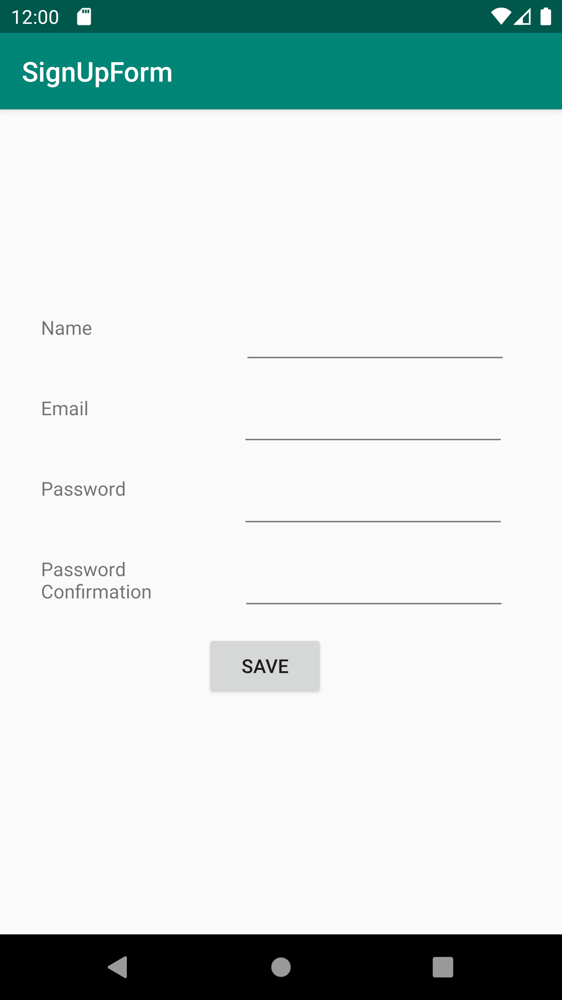
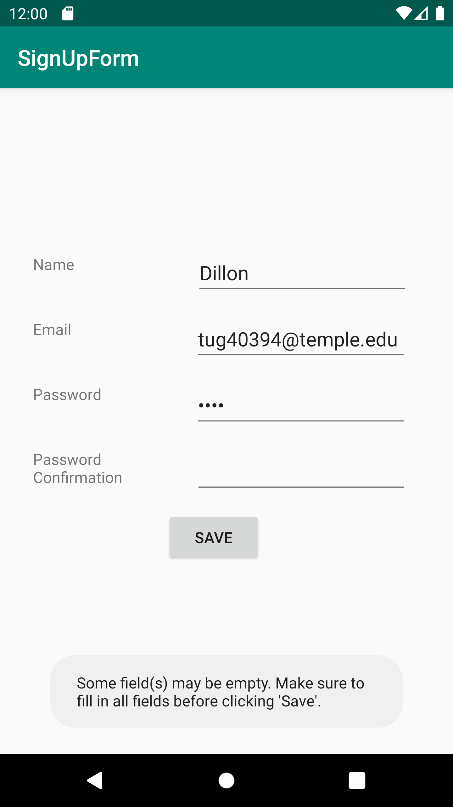
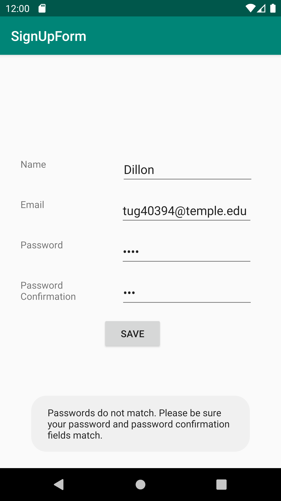
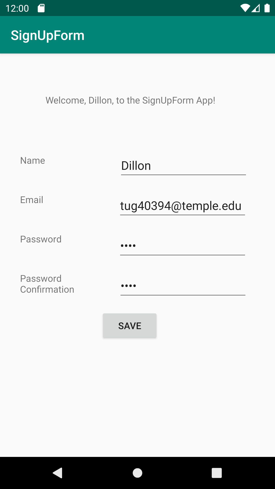

# SignUpForm App Starts Up

# User enters fields, leaves one empty, gets toast empty fields error

# User's password fields do not match, gets toast password error

# User's password fields match and all fields are populated, clicks save, and gets welcome message

